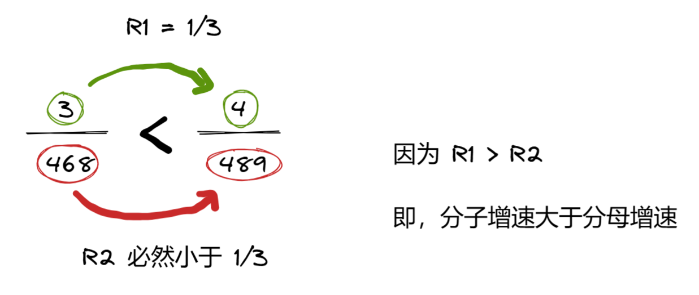
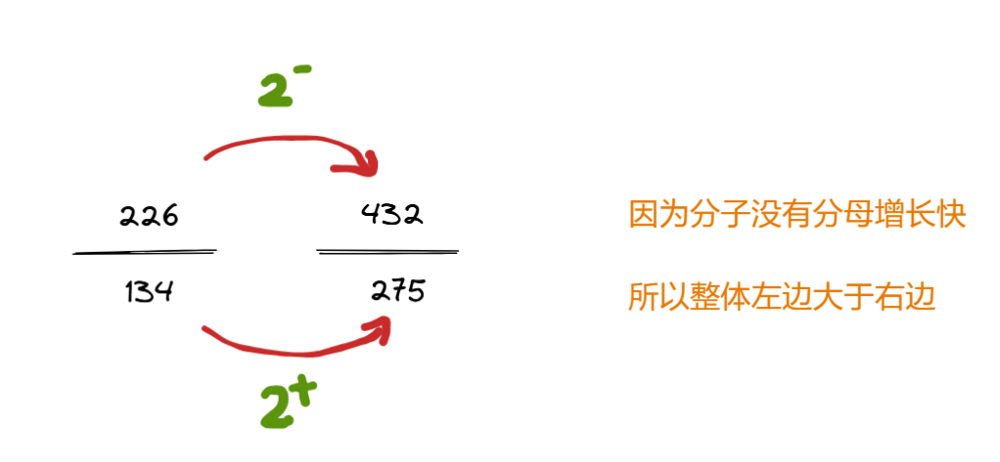
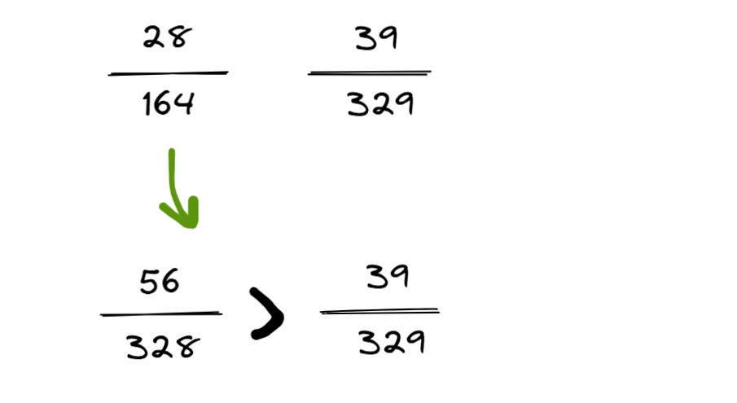
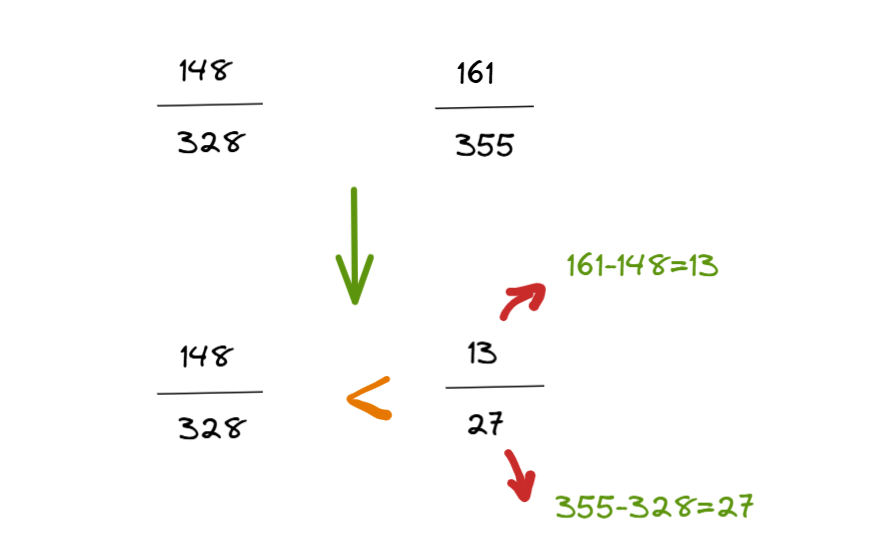

> [!NOTE]
>
> - 计算存在一点小误差，不必在意，所以 等号 实则为 越等号；
> - 如果确定题目要精算那就直除，这类情况较少；
> - 实际做题中，整百没有必要带着，如 200 直接 按照 2 参与计算，得到结果再考虑量级问题。
>

# 乘法（化整百）

☀️ **A00+BC** ☀️

$$ 136 \times 369 $$

= 136 × (300 + 69)

= 136 × 300 × (1 + 23%)

= 136 × (1 + 23%) × 300

= (136 + 27 + 4) × 300

= 167 × 300

= 167 × 3

= 501

&nbsp;

☀️ **A00-BC** ☀️

$$ 734 \times 188 $$

= 734 × (200 - 12)

= 734 × 200 × (1 - 6%)

= 734 × (1 - 6%) × 200 

= (734 - 44) × 200 

= 690 × 200 

= 69 × 2

= 138

# 除法（错位法）

1. 分子截取前 3 位；分母截取前 2 位，但时刻关注后 1 位的影响。
2. 把一个数往整百或者易计算的值靠拢，变化幅度上下保持一致。
3. 不需要四舍五入。

$$ \frac{438}{124} $$

124 **下降**到 100，变化幅度为 20%（24 占比 124）；

因此，438 **也要下降** 20%，即 438 - 88 = 350；

现在就是 350 / 100 = 3.5。

# 分数比较

## 看幅度

趋势比较法：借用比重趋势解题思路，根据分子分母增速大小判断分数大小

- 分子增速（倍数）大于分母，则分数变大
- 分子增速（倍数）小于分母，则分数变小

分子增速大于分母，则分数变大，所以右边的数大于左边的数。

## 看倍数

如果看倍数更快的话，也没必要非得去想幅度，因为倍数更容易看，更快些。

## 通分法

可将要比较的两个分数的分子或分母换算成同样大小

- 分母相同比分子，分子大的分数大
- 分子相同比分母，分母小的分数大

## 分子分母大大小小

$$\frac{148}{328}与\frac{161}{355}$$

可以看到，右边的数的分子和分母都比左边的数分子和分母大，且分子和分母靠的近。

大和分子减去小的分子，大的分母减去小的分母，得到的新分数等价替代最初的最大分子分母组成的分数。

​                                                  

