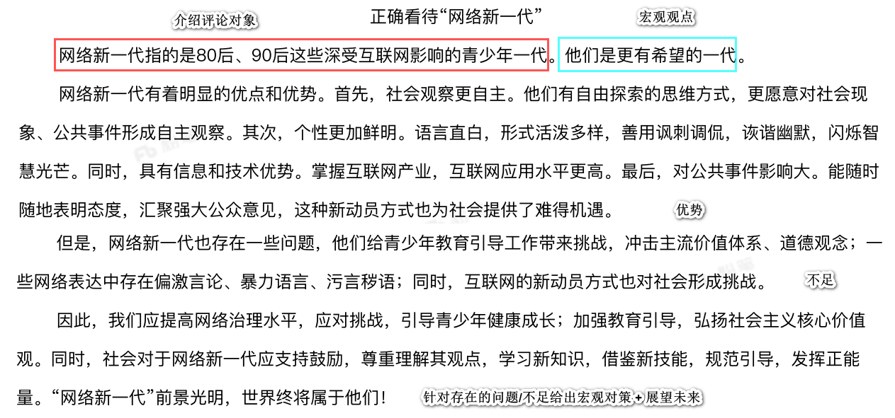

[TOC]

# 粉笔范文

# 他人范文

正确看待“网络新一代”

网络新一代指的是80后、90后伴随互联网发展而成长起来的的青少年一代。他们身上虽有争议，但也应当看到其身上的闪光点，他们是更有希望的一
代。

一方面，我们应当正视网络新一代身上的缺点。他们网络表达言论偏激语言暴力，污言秽语，恶俗程度令人震惊；他们给青少年教育引导工作带来挑战，冲击主流价值体系、道德观念。

另一方面，我们也要看到他们身上的闪光之处。一，社会观察自主。有自由探索的渠道和思维方式，自己寻找答案，更愿意对社会现象、公共事件形成自主观察。二，态度观点鲜明。语言直白，形式活泼，善用讽刺调侃，诙谐幽默，闪烁智慧光芒，令人拍案。三，互联网应用水平高。具有信息和技术优势，掌握互联网产业。四，对公共事件影响巨大。随时随地发出声音，表明态度，汇聚强大公众意见，显示了新一代的力量。

因此，我们应看到重视其身上的优点，尊重理解他们，让他们的才能充分发挥。另一方面，也要及时正确引导，积极帮助他们健康成长，并提高网络治理水平。我们期待青年真正成蝶的那一天，为祖国建设贡献力量！

&nbsp;

粉笔评分：18 分