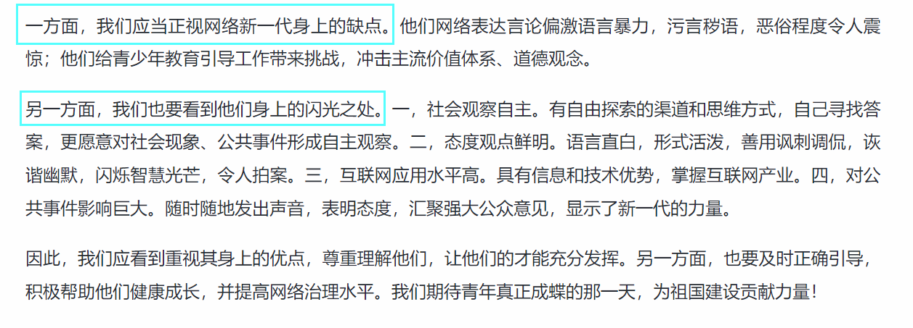

[TOC]

## 要介绍短评的对象

我在写的时候只给出宏观观点，却没有想到“网络新一代”这个概念本身就不是大部分人可以理解的概念，那么在评论对象之前，就想要给读者介绍这个概念的意思（材料中有讲）。

如：网络新一代指的是80后、90后这些深受互联网影响的青少年一代。

## 存在的问题要在结尾给出宏观对策

网络新一代的这些青年人在网络上的行为也有不恰当的地方，由于这道题本身不是专门去写对策，选择在结尾处给出宏观对策并展望未来。

## 有正有反如何介绍

实际上，开头和结尾不容易扣分，特别是结尾。

那么中间的主体部分该如何介绍？

题目中有几个表述值得我们注意：观点明确，层次分明。下次看到就要意识到文章中可能会介绍正反面的内容，要都写下来。

在他人范文中，我推荐有一篇文章的写法：

这种方式可以很好的引出正反内容。问题可以直接提出关键部分写出来，没必要写总括词（如果是专门找问题的就要写，但是本题的重心在优势部分）。对于优势部分，要写总括词，还要写中文序号，就像前面练习写对策那样。

