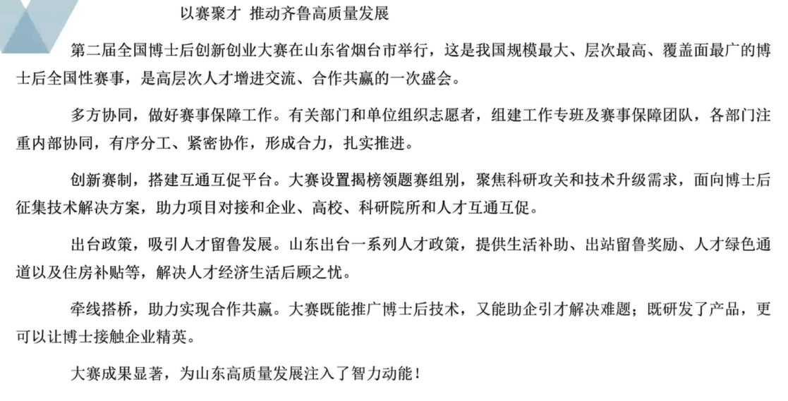

## 格式规范

| 标题 |       根据文章自拟标题，即对策+影响格式        |
| :--: | :--------------------------------------------: |
| 称谓 |                       ❌️                        |
| 开头 | 背景、目的、意义、影响、成就、宏观问题/对策... |
| 主体 |                   对策+影响                    |
| 结尾 |          期望、展望、号召、总结、呼吁          |
| 落款 |                       ❌️                        |

## 访问示例

