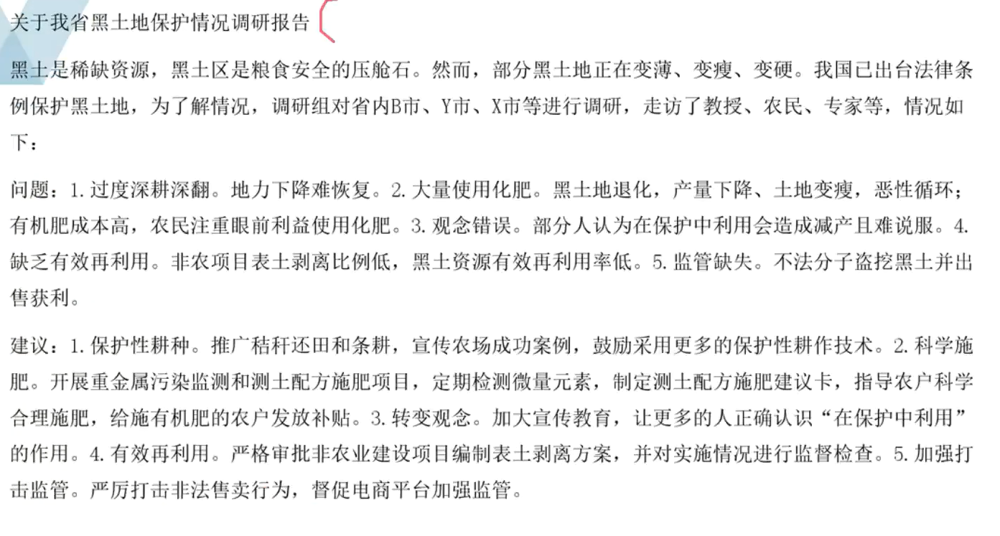
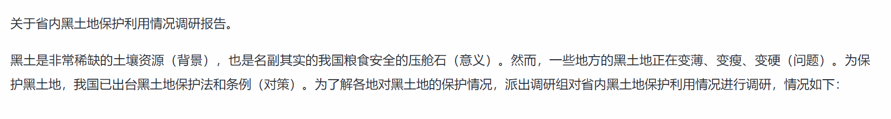
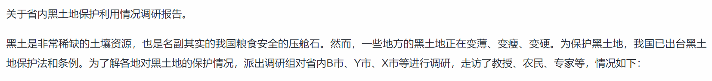

[TOC]

## 格式规范

| 标题 |                       关于...调研报告                        |
| :--: | :----------------------------------------------------------: |
| 称谓 |                              ❌️                               |
| 开头 | 背景、目的、意义、调查范围、调查对象、调查方式、宏观问题/对策... |
| 主体 |                        找问题，找对策                        |
| 结尾 |                   可有可无，字数不够可不管                   |
| 落款 |                              ❌️                               |

开头的内容并非只有那些，根据申论材料适当增删。

## 范文示例

来源：2023年公务员多省联考《申论》题（辽宁A卷）

## 标题与开头实战

存在的问题：缺乏具体的调研范围和调研对象。

如果没有通读全文，无法得出具体的调研范围和调研对象，故应该先粗读全文。

补充内容：派出调研组对省内B市、Y市、X市等进行调研（调查对象），走访了教授、农民，专家等（调查方式）。

