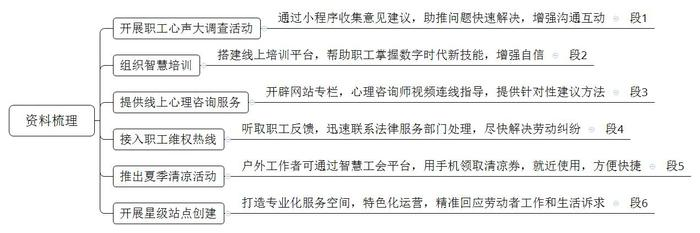

提到“S市总工会工作的优化，真正实现了以职工需求推动服务的新格局”，请说明S市总工会是如何实现这种新格局的。（15分）

要求：理解准确，内容全面，逻辑清晰。不超过250字。

---

周一早晨，上班途中的小杨收到S市总工会的一条信息，请他参加“职工心声大调查”，并附上了“连心桥”小程序的二维码。小杨打开小程序，看到上面有多种调查问卷和互动功能。他随机点开了一份关于工作环境的问卷，几分钟内就完成了填写。小程序提供了个“吐槽专区”，小杨在这个专区里分享了他对公司食堂伙食的看法。让他意想不到的是，没过几天，公司食堂居然改进许多。S市总工会发起的这次“职工心声大调查”活动，通过“连心桥”小程序收集到了大量意见和建议，有效助推各单位针对反馈的问题迅速展开行动，增强了与职工之间的沟通互动。

作为单位的资深员工，老欧越来越感觉自己跟不上数字时代的步伐了。听说S市总工会组织了智慧培训活动，他赶紧在总工会公众号上注册并登录了线上培训平台，选择了课程模块中的办公软件应用课程，通过视频里的生动讲解和实例分析，他很快就掌握了新技能。老欧通过了平台的在线测试，这让他在工作中增加了自信。“这种依托互联网、大数据的线上培训模式打破了时空限制，为我们搭建成长平台，创造更多发展机会，展示了工会服务职工的新思路和新作为。”老欧在平台的意见反馈区留言。

“工会的工作真是用心了！”全程体验了市总工会线上心理咨询服务的小萨充满感激地说。前段时间，高强度的工作和家庭生活琐事让她感到身心疲惫，压力巨大，通过S市总工会官方网站的心理咨询服务专栏，小萨预约了一位心理咨询师，通过视频连线，在咨询师引导下，小萨进行了系统的情绪管理练习，情绪渐渐变得稳定，对工作和生活的态度也有了积极的变化，几周后，咨询师根据小萨的进展，提供了更有针对性的建议和方法，帮助她更加从容地面对压力。小萨在工作群里分享了自己的这段体验，鼓励有类似困扰的同事也尝试这种服务。

2024年10月的一天，被劳动合同纠纷困扰的小白拨打了12351热线。“之前在单位工会的宣传栏里看到过全国总工会全面建成并运行12351职工维权服务热线的信息，现在遇到事了，也只是抱着试试看的想法拨了这个电话。”小白回忆说，“热线接通后，客服人员耐心听取了我的问题，并迅速帮我联系了S市总工会的法律服务部门。第二天，S市总工会法律援助中心就给我打来了电话，帮我解决了合同纠纷问题。”如今，12351职工维权服务热线已经成了工会和职工的“连心线”，搭起让职工群众“时时、处处、事事”放心的沟通桥梁。

“工会工作的创新总能给人带来惊喜！以前，我们的清凉福利都是线下发放，还得提前去排队，很不方便。现在通过手机就能领取清凉券，不仅省时，还能在附近商店直接用。”环卫工人老辛的满意溢于言表。2024年夏季，S市总工会通过智慧工会平台，推出了“夏季清凉”活动，使环卫工人、快递员、外卖员等户外工作者在炎热天气中及时得到清凉福利，极大地提升了他们的福利体验。

2024年6月16日，S市总工会首批“五星”站点授牌仪式在解放路户外职工爱心接力站举行。祥林区户外劳动者暖心驿站、西庄街道工会职工学堂等通过“百站升级”现场评估，获“五星”站点称号。根据S市总工会的工作要求及区域和产业发展实际，各级工会组织科学布点，扩大服务范围和覆盖面，围绕区域内户外职工爱心接力站、职工法援点、职工学堂等七大类百余个服务站点，开展“星级”站点创建，在产业工人、户外职工集聚的地方打造工会服务阵地，筑起服务职工的温馨港湾。“首批挂牌的‘五星’站点打造了诚意满满的专业化服务空间，通过‘一站一品’式的特色化运营，精准回应劳动者特别是户外劳动者和新就业形态劳动者的工作和生活诉求。”S市总工会职工服务中心陆主任在授牌仪式上说，“S市总工会工作的优化，真正实现了以职工需求推动服务的新格局。”

---

1. 程序收集意见建议：举行职工心声大调查，针对反馈的问题迅速展开行动。
2. 搭建线上培训平台：组织智慧培训活动，服务职工，创造发展机会。
3. 提供线上心理咨询：设立心理咨询服务专栏，线上预约心理咨询师，指导系统的情绪管理练习，提供针对性建议和方法。
4. 建成职工维权服务：运行12351热线，耐心听取用户问题，迅速联系法律服务部门，解决合同纠纷问题。
5. 搭建智慧工会平台：省时省力领取使用清凉券，推出夏季清凉活动，户外工作者及时领取清凉福利。
6. 开展星级站点创建：打造工会服务阵地，筑起服务职工港湾，打造专业化服务空间，回应劳动者诉求。

---

粉笔参考答案：

