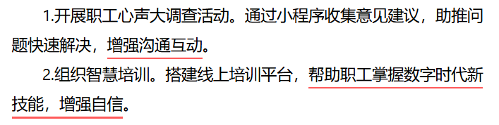

[TOC]

# 对策的识别

通常是**具体、可行、直接针对问题**的解决路径或行动方案，旨在改善现状、解决问题或推动发展。其核心特征是**具备可操作性**。

## 关键词识别

| 类别              | 说明                                                         | 关键词示例                                                   |
| :---------------- | :----------------------------------------------------------- | :----------------------------------------------------------- |
| **动词类**        | 这是最直接、最高频的对策标志。这些动词本身就是在描述一个具体的行动。 | 推进、推动、健全、完善、优化、加强、强化、加大、加快、深化、改革、创新、落实、抓好、做好、实施、实行、执行、建立、构建、打造、制定、出台、编制、开展、组织、引导、**鼓励、支持、保障、提升、提高、增强、突破**、发展、整顿、规范、治理、监管、监督、打击、保护、巩固、夯实 |
| **副词/形容词类** | 这些词常与动词搭配，使对策的方向和程度更加明确。             | 大力、全面、深入、加快、尽快、尽早、切实、积极、进一步、严格、依法、公开 |
| **名词类**        | 这些名词本身往往就是对策所要建立或依托的载体。               | 体系、机制、体制、制度、政策、法规、法律、办法、措施、方案、规划、计划、工程、项目、行动、平台、渠道、方式、模式、投入、资金、人才、技术 |

在这次解题过程中，我把「增强」误以为是对策执行后的效果，故没有写进对策，导致要点缺失。

## 句式识别法

1. **“要……”句式**：这是最典型的对策表达句式。

例：“各级政府**要**牢固树立绿色发展理念。”

&nbsp;

2. **“必须……”句式**：表达必要性，强调对策非做不可。

例：“我们**必须**加大对创新的投入。”

&nbsp;

3. **“通过/采取……手段/方式/措施”句式**：明确给出实现路径。

例：“**通过**开展专项整治行动，有效遏制了该现象。”

&nbsp;

4. **“建议/应该/应当/需要……”句式**：直接提出方案或意见。

例：“专家**建议**，**应当**建立长效管理机制。”

&nbsp;

5. **“目标是……，为此……”句式**：前半句是目标，后半句“为此”之后的就是对策。

例：“我们的目标是实现共同富裕。**为此**，要深化收入分配制度改革。”

&nbsp;

## 语境推断法

高水平的申论材料中，对策未必都以明显的“动词+名词”形式出现，有时会隐藏在上下文逻辑中。

**从“问题”反推**：材料详细描述了某个问题，其后的内容或与之对应的部分，往往就是解决该问题的对策。

- **问题**：“当前，部分基层干部服务意识淡薄，工作效率低下。”
- **对策**：“亟需加强干部队伍的思想教育和业务培训，建立健全绩效考核机制。”

&nbsp;

**从“经验/成功做法”中提炼**：材料介绍某个地区、国家或企业的成功实践，这些实践本身就是现成的、被验证过的对策。

- **经验**：“A市通过引入‘城市大脑’智慧管理系统，极大地提升了交通治理效能。”
- **对策**：“推广运用智慧城市管理技术，提升治理现代化水平。”

&nbsp;

**从“原因分析”中推导**：材料分析了问题产生的原因，那么针对原因采取的解决措施就是对策。

- **原因**：“人才流失严重的主要原因在于薪酬待遇偏低和发展空间受限。”
- **对策**：“提高人才薪酬待遇，拓宽职业发展通道。”

## 注意

- **优先级**：**动词引导的明确对策 > 句式引导的对策 > 需要推导的隐性对策**。在时间紧张时，优先抓取最明显的部分。
- **注意概括性**：找到对策关键词或句子后，要能用简洁、规范的语言将其概括出来，而不是简单照抄原文。
- **区分“对策”与“效果”**：对策是具体的做法（如“加强执法”），效果是做法带来的结果（如“市场秩序明显好转”）。不要将效果误判为对策。
- **组合出现**：在实际材料中，关键词和句式常常是组合出现的，形成一个完整的对策表述。

# 写好总括词

能准确概括其后数个具体要点核心本质的词语或短语，通常放在一条要点的最前面。

**重要性体现在：**

1. **形式美观，条理清晰**：让阅卷老师一眼抓住你的逻辑。
2. **体现高度，展现素养**：表明你能从具体现象中提炼出本质，符合机关工作“先总后分”的叙事习惯。
3. **锁定高分**：评分标准中通常有“要点清晰、归纳恰当”的要求，总括词是实现这一要求最直接的方式。

注意：总括词应简洁明了，通常 4 到 6 个字为佳，不要写成一个长句。

## 方法一：材料提炼法（最基础、最常用）

直接从材料中寻找高频词、高端词、关键词。

1. **抓高频词**：材料反复出现的词汇，往往是核心。
2. **抓高端词**：材料中领导、专家讲话，政策文件中的规范表述，直接拿来用。
3. **抓中心句**：一段或几段材料的首句、尾句，其核心意思就是总括词。

## 方法二：自行归纳法（体现能力水平，需要积累来提升）

**“做法” → “名词”**：将具体的动词描述，归纳为一个名词性的领域。

- **具体做法**：修建公路、铺设光纤、建设5G基站。
- **总括词**：**完善基础设施**。

&nbsp;

**“目的” → “手段”**：分析这些具体措施的共同目的，用实现该目的的手段来概括。

- **具体做法**：开展技能培训、提供创业贷款、开发公益岗位。
- **共同目的**：帮助群众就业。
- **总括词**：**强化就业保障**。

&nbsp;

**“具体” → “抽象”**：从微观操作上升到宏观概念。

- **具体做法**：安装监控、增派巡逻警力、开展防盗宣传。
- **总括词**：**健全治安防控体系**。

## 方法三：模板套用法（快速上手，保证规范）

| 领域              | 常用总括词（“模板”）                                         |
| :---------------- | :----------------------------------------------------------- |
| **思想/意识层面** | 加强宣传引导、转变思想观念、树立……理念、提高思想认识、凝聚社会共识 |
| **制度/政策层面** | 完善法律法规、健全制度体系、优化政策供给、建立长效机制、制定标准规范 |
| **监督/执行层面** | 加强监督管理、强化执法力度、压实主体责任、开展专项整治、严格考核问责 |
| **资源/保障层面** | 加大资金投入、引进专业人才、完善基础设施、推动技术革新、保障物资供应 |
| **公共服务层面**  | 优化服务流程、提升服务效能、创新服务模式、推进信息公开、畅通反馈渠道 |
| **经济/产业层面** | 优化产业结构、培育新兴动能、激发市场活力、扶持中小企业、打造特色品牌 |
| **民生/福祉层面** | 补齐民生短板、强化社会保障、促进就业创业、优化资源配置、推进共同富裕 |

## 提升总括词质量的进阶技巧

1. **力求精准**：不要满足于“加强管理”、“采取措施”这类万金油词汇。要力求精准，比如“加强**网格化**管理”、“采取**市场化**措施”。
2. **善用“动宾结构”**：总括词多为“动词+名词”的动宾短语，如“**健全**体系”、“**加大**投入”、“**优化**布局”，这样显得干脆有力。
3. **学会“四字格”**：使用“优化环境”、“保障民生”、“夯实基础”、“筑牢防线”等四字词语，更显精炼和专业。
4. **注意逻辑层次**：如果答案有多个要点，总括词之间最好有一定的逻辑关系（如由思想到行动，由内部到外部）或属于同一维度（如经济、政治、文化、社会、生态），避免交叉重叠。
