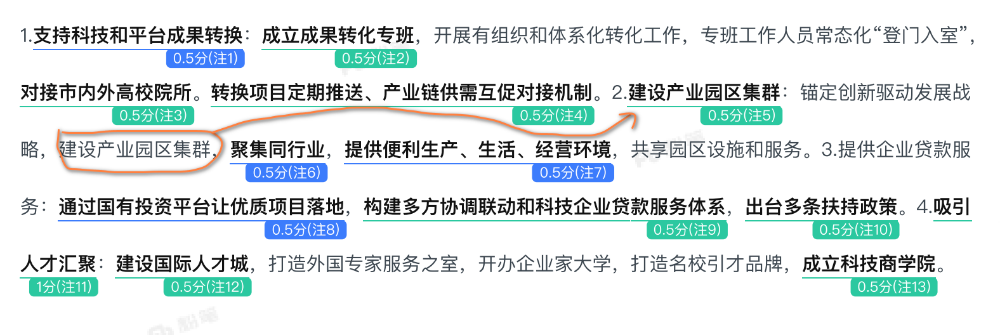

[TOC]

# 要概括的对策很多，字数受限

题目要求不超过 250 字，粗读全文发现有 4~5 个概括点，意味着一个概括点只可以写 50 字左右，相当不宽裕。

这要求**提取核心的策略，其余策略就得舍去**。在前面的基础上，还要**把选择的策略进行精简**。

### 审题定 “边界”—— 先排除无关对策

题目说「A 市积极促进高科技企业和新兴产业发展的主要做法」。

抓住关键词 A 市、高科技企业、新兴产业，由于这道题是确定材料且材料中并没有出现无关论述，暂时不需要面对这个问题。

### 读材辨 “主次”——抓 “核心对策” 弃 “细节补充”

材料中的对策常分 “核心策略”（宏观、根本、覆盖范围广）和 “细节措施”（微观、补充、针对具体场景），优先保留核心策略，细节可合并或删减。判断 “核心对策” 的 3 个标准：

1. **高频出现**：同一策略在材料不同段落反复提及；
2. **权威表述**：来自政府文件、领导讲话、专家建议的对策；
3. **统领性强**：能涵盖多个细节措施的 “总对策”。如「A市成立了5个市级科技成果转化专班，专门开展有组织、体系化的科技成果转化工作，专班工作人员常态化“登门（校门）入室（实验室）”」，概括为「成立专班」，后面的内容只是具体的展开。

### 同类 “合并”—— 避免重复占用字数

| 合并维度 | 示例（材料中的零散对策）                     | 合并后的概括对策                               |
| -------- | -------------------------------------------- | ---------------------------------------------- |
| 主体一致 | 政府补贴、政府培训、政府搭建平台             | 政府通过补贴、培训、搭建平台提供支持           |
| 手段一致 | 企业引入技术、高校研发技术、科研机构推广技术 | 企业、高校、科研机构协同推进技术研发与推广     |
| 目标一致 | 社区建文化站、开书法课、办邻里节             | 社区通过建设文化设施、开展文化活动拉近居民距离 |

### 语言 “精简”—— 保留 “主体 + 动作 + 对象” 核心结构

每条对策只保留 “谁（主体）+ 做什么（动作）+ 针对什么（对象 / 目标）” 的核心要素，删除修饰语、例子、过程性描述。

- 原对策（冗长）：“市文旅局为了吸引更多游客，专门联合各大旅行社，设计了‘非遗体验 + 乡村民宿’的特色旅游线路，并通过抖音、小红书等平台进行宣传推广。”
- 精简后（核心）：“市文旅局联合旅行社设计‘非遗 + 民宿’旅游线路，通过新媒体宣传。”

### 检查 “控字”—— 最后做 “减法” 或 “微调”

写完后对照字数要求，若仍超字数，按以下优先级删减：

1. 先删 “补充说明”：如对策后的例子、数据（如 “投入资金 500 万元” 可删为 “投入专项资金”）；
2. 再并 “相近对策”：若两条对策目的高度相似（如 “加强宣传” 和 “普及知识”），可合并为 “加强宣传普及”；
3. 后缩 “动词短语”：用更简洁的动词替换（如 “开展…… 活动”→“举办……”，“建立…… 机制”→“设…… 机制”）。

# 总括词的内容不要在后面具体表述中再重复

# 以优先级看待对策的选择

| 优先级     | 对策特征                                                     | 处理方式                                   |
| :--------- | :----------------------------------------------------------- | :----------------------------------------- |
| **第一级** | 材料中直接给出的、已经成形、可立即执行的对策                 | **优先保留，直接转述**（只需稍作语言规范） |
| **第二级** | 涉及体制机制改革、系统建设等宏观布局，虽不够具体但决定工作方向 | 提炼核心，精简表述                         |
| **第三级** | 指出工作方向但缺乏具体内容，更多是工作理念或要求             | 转化为具体措施                             |
| **第四级** | 描述现状、分析原因、阐述重要性，但未直接给出对策             | 果断舍弃或融入对策                         |

举例说明：

“近年来，随着电子商务迅猛发展，网络消费纠纷数量大幅上升，消费者维权面临新的挑战。为此，市场监管部门将建立线上调解平台，实现纠纷快速处理；同时要加强电商领域信用体系建设，对失信商家实施联合惩戒；此外，还需要大力开展消费者教育活动，提升消费者辨识能力和维权意识；各相关部门要高度重视这一问题，切实加强协作配合……”

| 原文内容                                               | 优先级判定    | 处理方式           | 最终概括                         |
| :----------------------------------------------------- | :------------ | :----------------- | :------------------------------- |
| “建立线上调解平台，实现纠纷快速处理”                   | 第一级        | 直接保留，精简表述 | “建立线上调解平台”               |
| “加强电商领域信用体系建设，对失信商家实施联合惩戒”     | 第一级+第二级 | 合并表述           | “完善电商信用体系，实施联合惩戒” |
| “大力开展消费者教育活动，提升消费者辨识能力和维权意识” | 第二级        | 提炼核心           | “加强消费者教育”                 |
| “各相关部门要高度重视这一问题，切实加强协作配合”       | 第三级        | 转化为具体措施     | “建立部门协作机制”               |
| “近年来…面临新的挑战”                                  | 第四级        | 完全舍弃           | （不写入）                       |