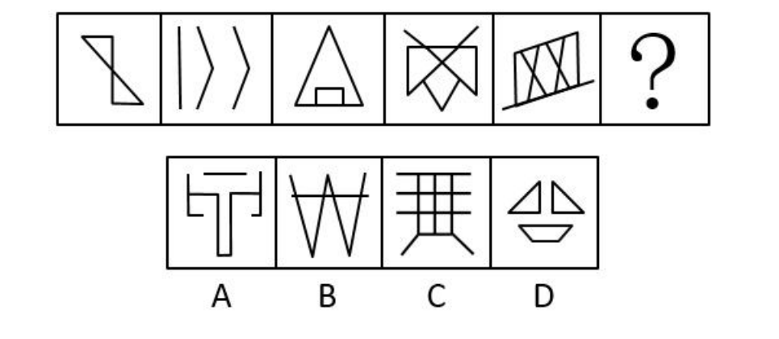
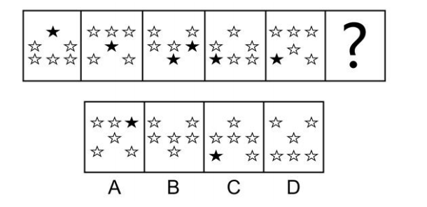

# 黑白图

注：内圈（中间4个格子）和外圈（12个格子）

1. 黑色方块数量相同
2. 外圈黑色方块数量始终保持 3 个，内圈黑色方块数量始终保持 2 个

推测考察外圈的旋转，内圈的平移或旋转。

&nbsp;

内圈的两个小黑块都是顺（逆）时针每次移动一个格子，最下面的小黑块是每次向右移动一个格子（循环移动）。

外圈小黑块，最右竖排相连的两个小黑块是每次逆时针移动一个格子。

&nbsp;

==参考答案==：C

---

第二幅图的外圈数量不再是六个，说明不是看内外圈。

那就按行来看，数量变化同上。还没结束，是否存在黑白叠加运算？好像有这个规律，第一幅图到第二幅图的第一行黑白交换，第二幅图到第三幅图的第二行黑白交换。但是，我们发现这个规律后，前面已经更换的元素位置在发生变化，所以这个规律并不可用。

那就斜着看，发现黑白元素的数量全是固定。故考察斜方向的移动。

&nbsp;

==参考答案==：B

---

# 多边形被分割

第四幅图大致猜出不可能考察总交点数量、直角数量。

第一幅图到第三幅图摆明不可能考察面的数量。

这道题考察的内交点数量的规律，即 0，1，0，1 如此循环。

&nbsp;

==参考答案==：B

# 线数量

纯直图形，由于不是分类，那就可能考察直线数量。

第五幅图没有对称性，排除考察对称的可能。

第二幅图并没有三角形，排除考察特殊形状三角形。

这道题考察直线数量，尽管一开始不想往这个方面想，因为最后两幅图直线数量很多。

不过，从这道题我们可以看出直线数量怎么数？出现拐点就截止算一条直线。

&nbsp;

==参考答案==：C

# 交点数量

第一幅图，第五幅图，和选项ABC 强烈感受到交点的考察。

规律是每一列的第一幅图交点数量加第二幅图交点数量等于第三幅图交点数量。

# 其它

初看还可以考察等价替换，结果发现数量相同且第三幅图直接 PASS 前面的考虑。

这道题已有图形是干扰，真正的核心在空白处。

&nbsp;

==参考答案==：D

# 好图积累

## 直角特征

