# 不知道政治理论，仅通过言语层面去做题

# 积累政治理论，不可抛弃的底层逻辑

## 人民与公民的区别

- **公民**是 “<u>法律</u>上的<u>身份</u>”，只要有国籍就是；

- **人民**是 “<u>政治</u>上的<u>阵营</u>”，只有符合立场、推动社会进步的群体才是。

&nbsp;

简言之：**所有人民都是公民，但并非所有公民都是人民**。

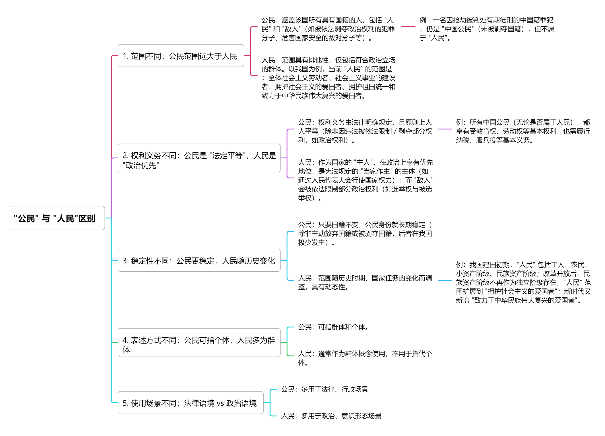

## 粮食安全指什么？

我国对粮食安全的定义更贴合国情，明确 “粮食” 不仅包括**小麦、水稻、玉米**三大主粮，还涵盖**杂粮（如燕麦、荞麦）、大豆、食用油、薯类**等重要农产品。

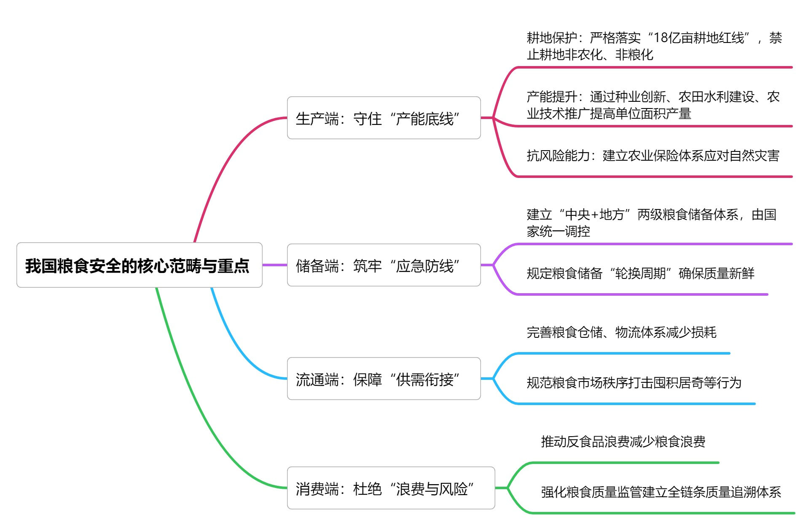

简言之，粮食安全是 “**够不够、能不能拿到、安不安全、稳不稳定**” 的综合保障

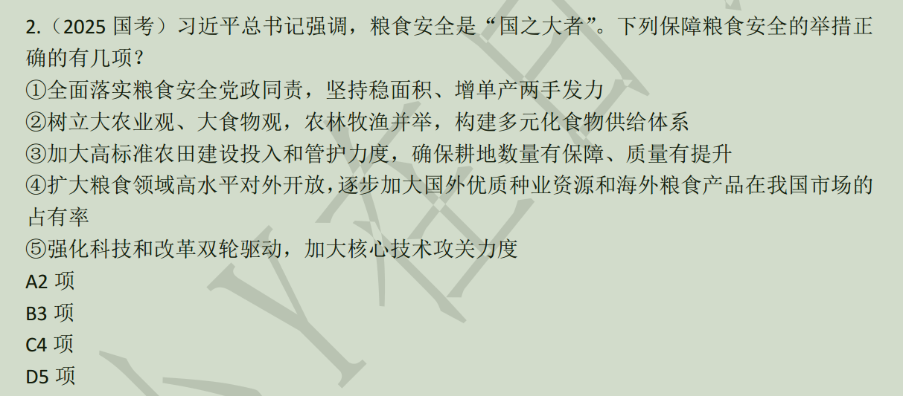

4 没有保证存储端在我国手里，受制于人，没有粮食安全保障。

5 和粮食安全没有关系，除非说科技助推粮食增产等。

## 18亿亩地耕地红线

## 腐败

狭义定义：特指**公职人员（含国家机关、国有企事业单位、公共机构工作人员）** 利用职务便利，通过贪污、受贿、挪用公款、滥用职权等行为，为自己或他人（如亲友、利益集团）谋取非法利益，同时损害国家、集体或公众利益的行为（这是最常见、危害最直接的腐败类型）。

1. 行为主体必须掌握一定的 “权力”，且行为依赖于这一 “权力便利”（若无权力加持，该谋利行为无法实现）；
2. 行为的核心目的是为**私人或特定小群体**谋取非法利益（包括金钱、财物、职位、机会、特权等），而非服务于公共利益；
3. 行为直接或间接破坏公平正义、公共秩序或集体利益，即使未直接 “贪污钱财”，只要导致公共资源浪费、机会不公、社会信任受损，仍属于腐败。

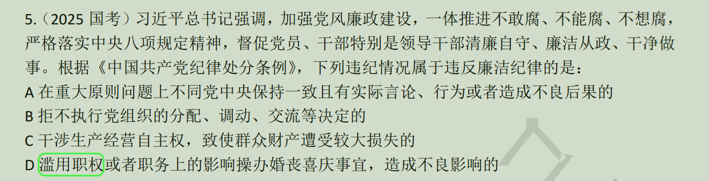

会有人纠结 C 和 D，尽管 C 看起来也像腐败，但是 D 更加明确，即滥用职权。

## 什么是民生

民生问题呈现出**由低到高的递进式结构**，包括三个层面的内容：

1. **生存底线层**这是民生的基础，确保每个人 “像人一样有尊严地生存”。具体包括：

   - **基本生活保障**：通过社会救济、最低生活保障等制度，确保低收入群体的衣食住行需求（如城乡低保、特困人员供养）；

   - **基础性公共服务**：普及义务教育、基本医疗、保障性住房等（如我国 “两免一补” 政策、农村危房改造）。

这一层面的目标是消除贫困和饥饿，解决 “有没有” 的问题。

&nbsp;

2. **发展机会层**在生存需求满足后，民生转向**提升发展能力和机会公平**。具体包括：

   - **就业与技能培训**：通过职业教育、就业援助等，帮助劳动者获得收入来源（如我国 “春风行动” 促进农民工就业）；

   - **权益保护与社会流动**：消除性别、地域、户籍等歧视，保障劳动权、财产权等基本权利，拓宽上升通道（如取消就业中的乙肝歧视条款）。

这一层面的目标是让每个人 “有能力活下去”，解决 “能不能” 的问题。

&nbsp;

3. **生活质量层**随着经济发展和公共财力提升，民生进一步关注**生活品质的全面改善**。具体包括：

   - **普惠性社会福利**：如免费高等教育、全民医保、住房公积金普及（我国正逐步推进这些目标）；

   - **文化与精神需求**：建设公共文化设施（如图书馆、博物馆）、发展体育事业、推动心理健康服务（如深圳龙华区 “10 分钟文体圈”）。

这一层面的目标是实现 “生活得更好”，解决 “好不好” 的问题。

&nbsp;

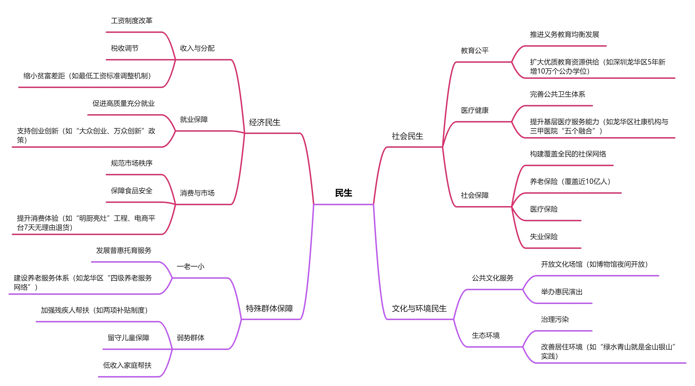

下面这道题有人会以为 ① 是正确的，但其实后面有几句话没有写进来（这是出题人的小心思），即后续内容为更好保障青年科技人员待遇。健全保障科研人员专心科研制度。这明显就不是民生问题。

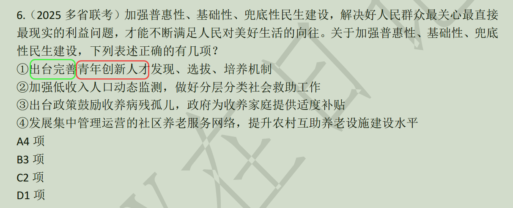

民生的本质是**以人民为中心的发展思想**，其核心是**让每个人都能共享发展成果**。

从思维导图来看，我觉得民生问题有些特点就是解决基础保障的问题、福利会共享（虽然是针对老人，但你有天也会变老，也是一样享受福利，只是现在还没到你，况且你家老人享受福利就相当于你享受福利）、与人民息息相关（比方说环境保护，公共设施等）。

## 长三角一体化发展取得的成就

## 三农--农村、农民和农业

农民是农业生产的实践者、农村建设的参与者，“三农” 问题的本质是 “人的问题”，核心是**保障农民权益、促进农民增收、提升农民素质**，具体包括：

- **收入保障**：通过 “提高农业收益（如粮食补贴、农机购置补贴）、拓宽非农渠道（如农民工就业、乡村创业）、完善社会保障（如农村养老保险、低保）”，解决 “农民增收难” 问题（2023 年我国农村居民人均可支配收入达 23598 元，增速连续多年快于城镇居民）。
- **权益保护**：重点保障农民的土地权益（如土地承包经营权、宅基地使用权、集体收益分配权），避免 “土地被侵占、利益被损害”（如《农村土地承包法》明确 “承包地不得随意收回”）。
- **能力提升**：通过职业农民培训（如种植技术、电商运营）、教育普及（如农村义务教育营养改善计划），提升农民的生产技能和综合素质，让农民从 “传统务农者” 向 “新型职业农民” 转型。
- **社会融入**：减少户籍、就业、教育等方面的 “身份歧视”，推动农民工市民化（如保障农民工子女就近入学、享受城市医保），实现 “农民在城乡间可进可退”。

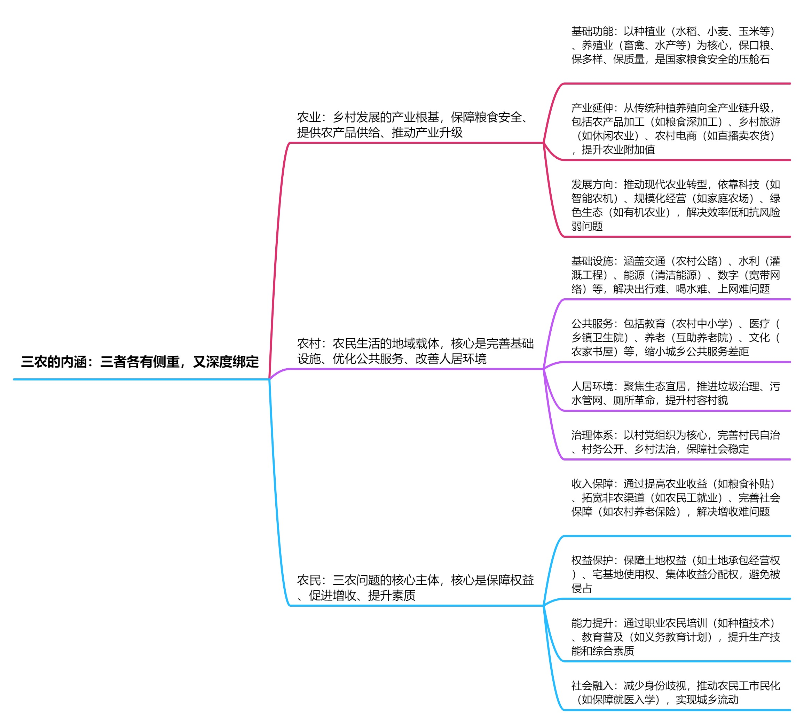

## 四大考验

长期执政考验一一长期执政中内部遇到的问题；（权力的监督、执政的能力的挑战）

改革开放考验一一在改革开放的过程中涉及到利益调整、制度完善；

市场经济考验一一聚焦市场经济条件下利益的诱惑、资源的配置问题；（国内）

外部环境考验一一经济全球化遭遇逆流，国际格局调整。（国外，即国际）

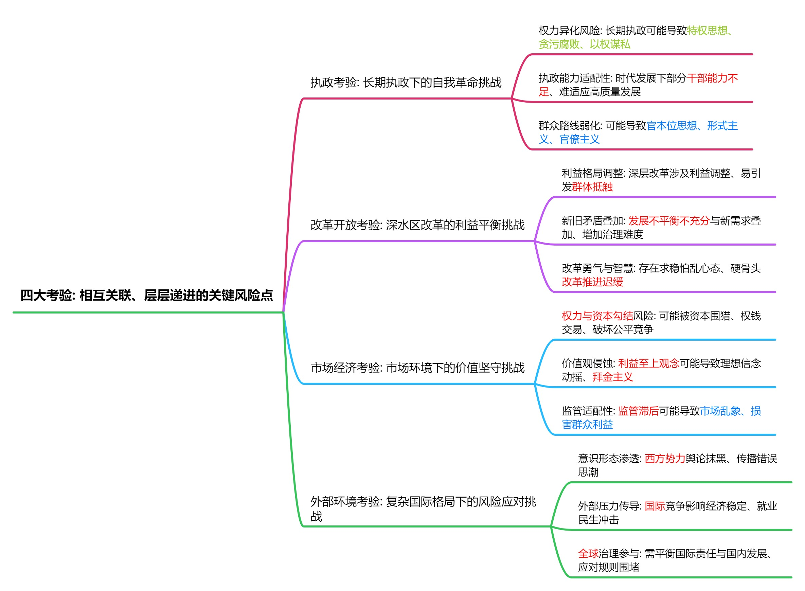

## 四大危险

精神懈怠危险，能力不足危险，脱离群众危险，消极腐败危险。

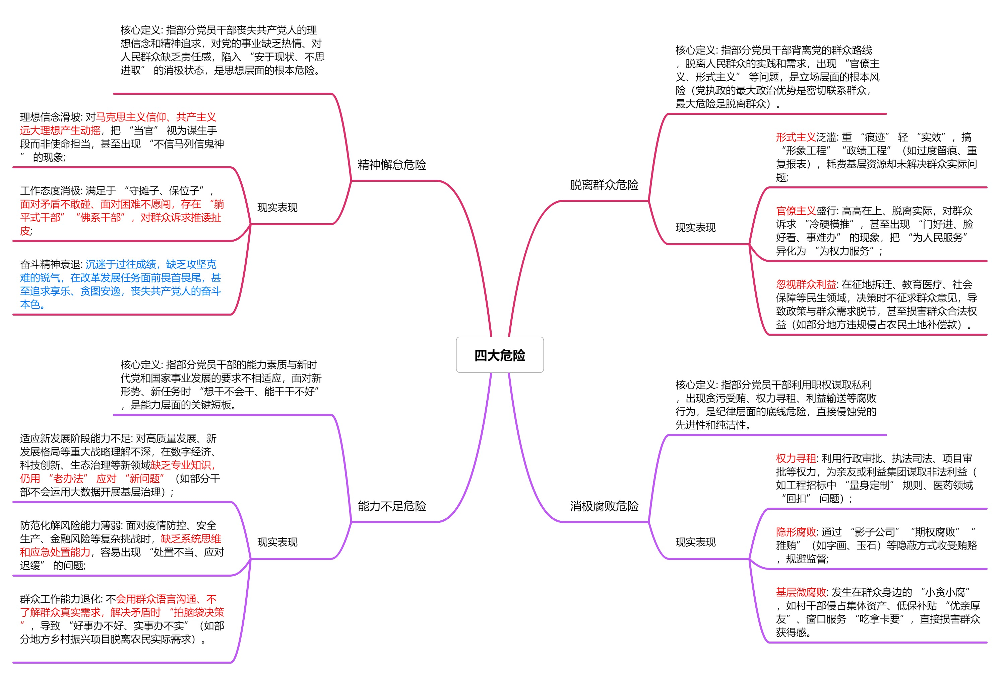

## 守正创新与自信自立

守正创新，对内：把自己的东西进行创新。

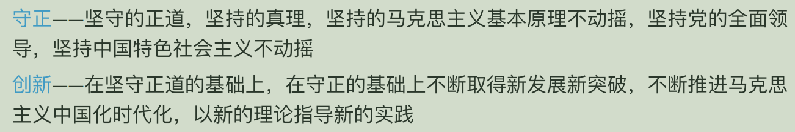

自信自立，对外：中国的问题必须从中国基本国情出发，由中国人自己解答。

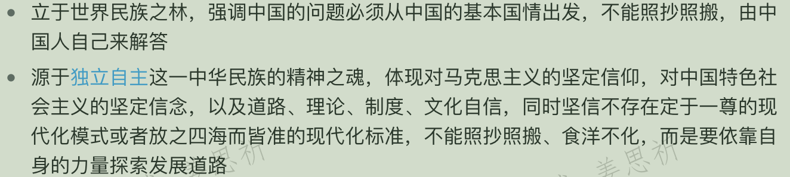

## 拉动经济的三辆马车：投资，消费，出口

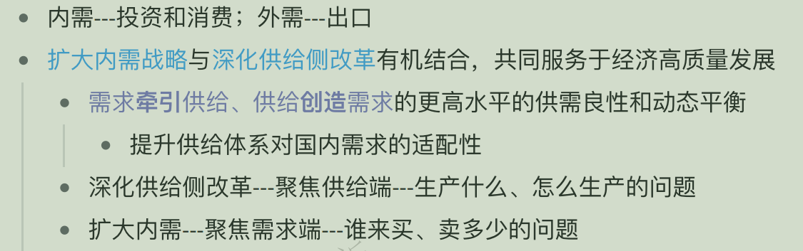

需求牵引供给，供给创造需求。

深化供给侧改革 ---> 聚焦供给端，扩大内需---> 聚焦需求端。

内需 ---> 投资和消费，外需 ---> 出口。

## 生态文明建设的基本方针

节约优先，保护优先，自然修复为主。

节约优先：强调在资源开发利用的全过程中，优先通过技术创新、优化管理等手段**提高资源利用率，减少资源的消耗和浪费**，从源头降低对生态环境的压力。

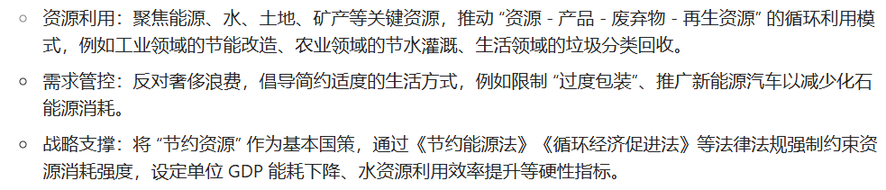

保护优先：要求在经济社会发展与生态保护的关系中，优先保障生态系统的完整性和稳定性，**避免以牺牲环境为代价，来换取短期的经济增长** —— 绿水青山就是金山银山。

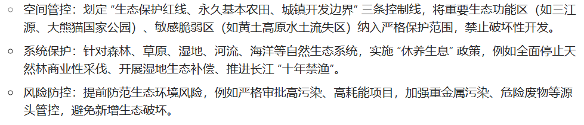

自然恢复为主：注重发挥**生态系统自身的修复能力**，**减少人为干预**对自然生态的破坏。

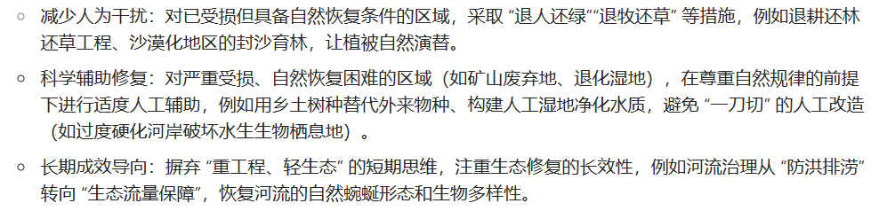

## 习思想

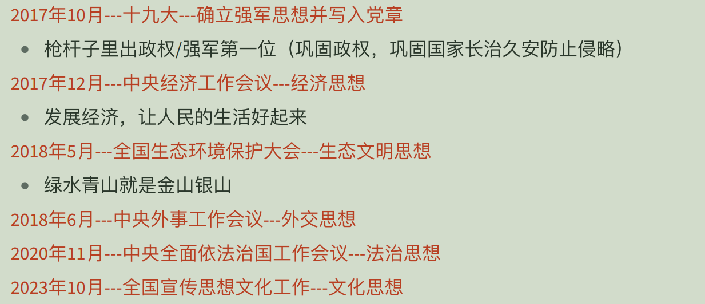

强军思想  ---> 经济思想  ---> 生态文明思想  ---> 外交思想  ---> 法治思想  ---> 文化思想。

## 权利和义务

权利是指法律或社会规范赋予主体（如公民、法人）的**正当利益、行为自由或受保护的资格**，主体有权自主决定是否行使，且他人不得非法干涉。

义务是指法律或社会规范要求主体（如公民、法人）**必须为一定行为或不为一定行为的责任**，主体不得随意拒绝，否则将承担相应后果（如法律制裁、道德谴责）。
