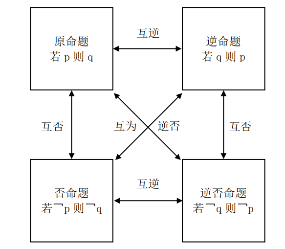
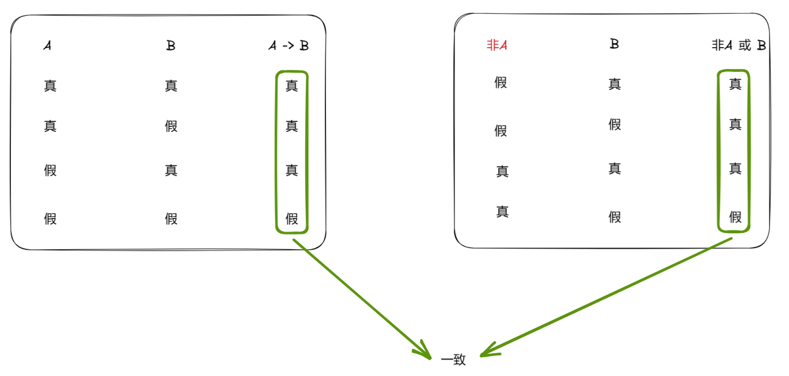
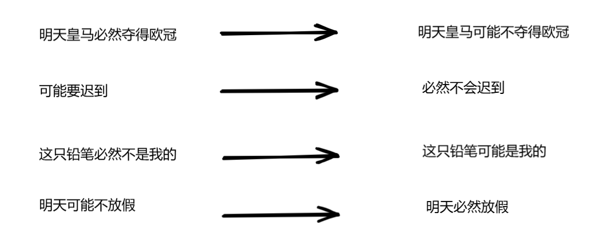
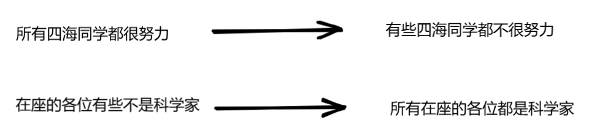
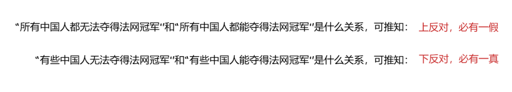
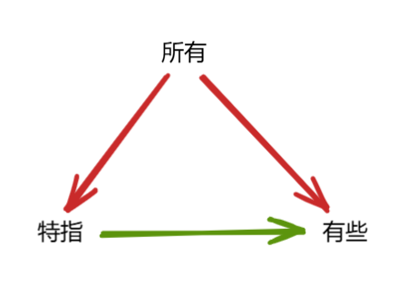
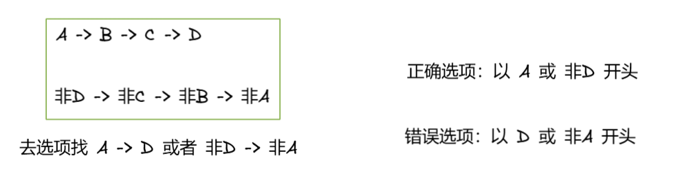
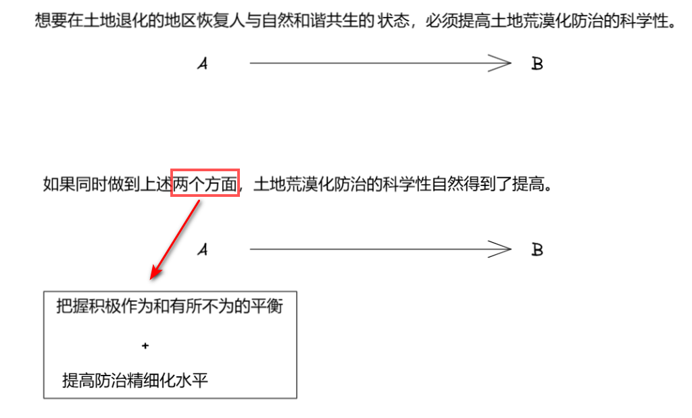
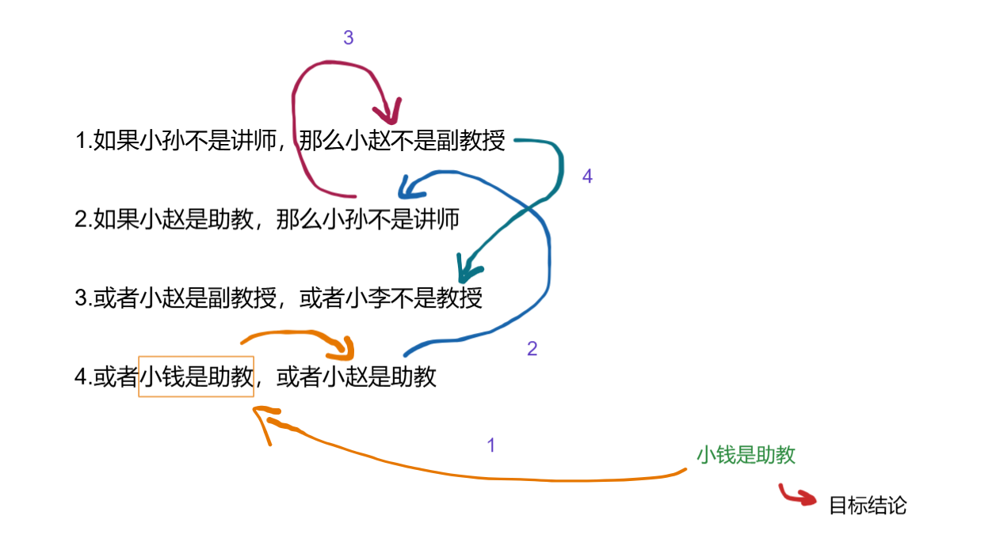

[TOC]

# 逻辑基础

## 命题

用语言、符号或者式子表达的，==可以判断真假的陈述句==称为命题。

其中判断为真的语句称为真命题，判断为假的语句称为假命题。

示例：陈述句翻译为「若 p 则 q」

- 陈述句：小李是中国人  → 翻译为「若是小李，则是中国人」
- 陈述句：明天是星期三  → 翻译为「若是星期三，则是明天」

### 命题的四种形式与关系

==原命题==：若是小李，那么他是中国人。

==逆命题==：若是中国人，则他是小李。

==否命题==：若不是小李，那么他不是中国人。

==逆否命题==：若他不是中国人，则不是小李。

==原命题与逆否命题的真假是一致的（等价）==，与否命题和逆命题真假无必然联系。

==逆命题与否命题的真假是一致的（等价）==，与原命题和逆否命题真假无必然联系。

### 命题的传递规则

- A → B，B → C，可联立，得出 A → C；
- A → B，C → A，可联立，得出 C → B；
- A → B，非C → 非B（逆否得出 B → C），可联立，得出 A → C；
- A → B，C → B，不可联立；
- A → B，A → C，不可联立。

### 命题的真假判断

| p    | q    | p→q  |
| :--- | :--- | :--- |
| 真   | 真   | 真   |
| 真   | 假   | 假   |
| 假   | 真   | 真   |
| 假   | 假   | 真   |

p 条件满足，就得触发 q 条件，否则为假。

p 条件不满足，q 条件否与不否并无所谓，都为真。

&nbsp;

原命题：如果今天下雨，那么我带伞。

| 命题                         | 真假 |
| :--------------------------- | :--- |
| 如果今天下雨，那么我带伞     | √    |
| 如果今天下雨，那么我不带伞   | ×    |
| 如果今天不下雨，那么我带伞   | √    |
| 如果今天不下雨，那么我不带伞 | √    |

==「p → q」的矛盾命题为「p 且 非q」==。

## 复合命题

==复合命题==是指由简单命题用联结词联结而成的命题。

示例：

- ==如果==小李是犯罪嫌疑人，==那么==小李有犯罪动机。
- ==或者==明天是星期三，==或者==明天是星期四。

- 王武的计算机配置合理==并且==价格低廉。

### 联言命题

联言命题是反映事物的若干种情况或者性质==同时存在==的命题。

由逻辑联结词“并且”连接，写成 p 并且 q。

| 类别       | 内容                        |
| ---------- | --------------------------- |
| 常见指示词 | 并且、也、还、同时、“，”等  |
| 矛盾关系   | 非（p 且 q） = 非 p 或 非 q |
| 真假判断   | 全真为真，全假为假          |

矛盾关系指的是矛盾双方必然一真一假。在原命题前加“不”，即得到矛盾命题。

如「p 且 q」的矛盾是「非（p 且 q）」，「非（p 且 q）」等同于「非p 或 非q」。

### 选言命题

选言命题是反映事物的若干种情况或者性质==至少有一种存在==的命题。可分为相容选言命题和不相容选言命题。

由逻辑联结词“或者”或“要么”连接，写成 p 或 q、要么 p 要么 q。

#### 相容选言命题（或者）

| 类别       | 内容                                         |
| ---------- | -------------------------------------------- |
| 常见指示词 | 或者或者、A 和 B 至少一个、A 和 B 至多一个   |
| 矛盾关系   | 非（p 或 q）= 非p  且 非q                    |
| 真假判断   | 一真则真，全假为假                           |
| 等价规则   | p 或 q = 非 p → q = 非 q → p，即==否一推一== |

A 和 B 至少一个可翻译为「A 或 B」。

A 和 B 至多一个，即非A 和 非B至少一个，可翻译为「非A 或 非B」。

| p    | q    | p 或 q |
| :--- | :--- | :----- |
| 真   | 假   | 真     |
| 真   | 真   | 真     |
| 假   | 假   | 假     |
| 假   | 真   | 真     |

该如何去理解否一推一？

我要表达的就是「p 或 q（p → q）」等价于「非p → q 」，等价于「非q → p」。

#### 不相容选言命题（要么）

| 类别       | 内容                                            |
| ---------- | ----------------------------------------------- |
| 常见指示词 | 要么要么、A 和 B 二者不可兼得、不是 A 就是 B    |
| 矛盾关系   | 非（要么 p 要么 q）=（p 且 q）或（非 p 且非 q） |
| 真假判断   | 一真一假为真，全真全假为假                      |

为什么不相容选言命题两个命题都为真，反倒判断为假呢？

要么 A 是第一，要么 B 是第一。第一只能有一个，不相容选言命题两个命题都为真必然是矛盾的，故而为假。

| p      | q      | 要么 p，要么 q |
| :----- | :----- | :------------- |
| 真     | 假     | 真             |
| **真** | **真** | **假**         |
| 假     | 假     | 假             |
| 假     | 真     | 真             |

### 假言命题

假言命题就是陈述某一事物情况是另一件事物情况的条件的命题，假言命题亦称条件命题。

#### 关联词之如果那么

| 类别       | 内容                                             |
| ---------- | ------------------------------------------------ |
| 常见指示词 | 如果… 那么、若… 则、只要… 就、一… 就、所有… 都等 |
| 翻译规则   | ==前推后==（若 p 则 q，翻译为，p→q）             |
| 真假判断   | （p→q）当且仅当（p 真 q 假）时为假               |
| 等价规则   | p→q = 非 q→非 p = 非 p 或 q                      |

其实，如果那么的真假判断在前面有过记录，方便查看复制到这里一份。

| 命题                         | 真假 |
| :--------------------------- | :--- |
| 如果今天下雨，那么我带伞     | √    |
| 如果今天下雨，那么我不带伞   | ×    |
| 如果今天不下雨，那么我带伞   | √    |
| 如果今天不下雨，那么我不带伞 | √    |

还有，关于「非p 或 q」等价于「非q → 非p」如何理解？

根据前面章节讲的否一推一，「非p 或 q」相当于「p → q」，也就等价于「非q → 非p」。

#### 关联词之只有才

| 类别       | 内容                                                         |
| ---------- | ------------------------------------------------------------ |
| 常见指示词 | 只有… 才、必须… 才、才、不… 不等                             |
| 翻译规则   | ==后推前==（只有 p 才 q，翻译为， q→p）；==不不==（只有 p 才 q，翻译为，非 p→非 q） |

非p → 非q 逆否就等价于 q → p。

#### 关联词之除非否则

| 类别       | 内容                                           |
| ---------- | ---------------------------------------------- |
| 常见指示词 | 除非… 否则、必须… 否则、否则等                 |
| 翻译规则   | ==否 A 则 B==（除非 p 否则 q，翻译为，非 p→q） |
| 等价规则   | 除非 p 否则 q = 非 p→q = p 或 q                |

常见指示词可以简化为只要出现“否则”二字就是否 A 则 B。

## 模态命题（可能必然）

模态命题就是陈述事物情况的==必然性或可能性==的命题。

| 关系类型 | 内容                           |
| -------- | ------------------------------ |
| 矛盾关系 | 必然⊥可能不，可能⊥必然不       |
| 推出关系 | 必然能推出可能，可能推不出必然 |
| 等价关系 | 非必然＝可能不，非可能＝必然不 |

矛盾关系的记忆口诀为“两词互换，后面加不”。即必然与可能两词互换，后面再加上不。

如果添加上不的后面有不，就互相抵消。如：“明天可能不放假”替换后为“明天必然不不放假”，即“明天必然放假”。

## 直言命题（所有有些）

直言命题亦称“定言命题”，即性质命题，是断定事物性质的简单命题。

由于在性质命题中，==对对象具有或不具有某种性质的断定是直接的、无条件的==，因而，逻辑史上把这种命题称为直言命题，有别于假言命题（对对象的某种断定是有条件的）和选言命题（对对象的某种断定是有选择的）。

| 关系类型   | 内容                                                         |
| ---------- | ------------------------------------------------------------ |
| 矛盾关系   | 所有⊥有些不，有些⊥所有不                                     |
| 上反对关系 | 两个所有必有一假                                             |
| 下反对关系 | 两个有些必有一真                                             |
| 推出关系   | 所有→特指→有些；有些 p 是 q→有些 q 是 p；==有些 p 是 q 推不出有些 p 不是 q== |

矛盾关系的记忆口诀为“两词互换，后面加不”。

上反对关系和下反对关系：

推出关系：

“所有我班同学都能进面”：可推出有些同学进面了 / 小李进面了。

“我班有些同学迟到了”：推不出任何关系。

“我班的小李迟到了”：不可推出所有同学迟到，可以推出有些同学迟到。

## 充分必要条件

对于 p->q，p 是充分条件，q 是必要条件。

若 p 能推出 q 且 q 能推出 p，则 p、q 互为充分必要条件。

| 类型         | 常见提示词                                                 |
| ------------ | ---------------------------------------------------------- |
| 充分条件     | 如果… 那么…、若… 则… 等                                    |
| 必要条件     | 基础、关键、前提、必须、需要、离不开、必不可少、不可或缺等 |
| 充分必要条件 | 当且仅当                                                   |
| 翻译规则     | 充分条件是 p，必要条件是 q                                 |

可简单记为：谁是必要条件谁在箭头后面。

必要条件从字面理解就是发生的事情需要该条件存在，即事件发生的基础。因此，像关键、离不开、必不可少等词后面的往往就是必要条件。

# 翻译推理

## 等价推出

### 与题干等价

若将题干翻译为「A → B」，可以翻译为「A → B」或 「非B → 非A」为正确选项。

因此，以 B 或 非A 开头的选项可先排除。

&nbsp;

> 假如“人工智能发展到了最高的层级，才可以表达类似于人类的情感”为假，那么以下为真的是：
>
> A.人工智能现在已经发展到了最高的层级，可以表达类似于人类的情感
>
> B.人工智能不能表达类似于人类的情感，就没有发展到最高的层级
>
> C.人工智能没有发展到最高的层级，也可以表达类似于人类的情感
>
> D.人工智能可以表达类似于人类的情感，不一定发展到了最高的层级

解析：

翻译为「表达类似于人类的情感 → 人工智能发展到了最高的层级」，等价于「人工智能没有发展到最高的层级 → 不可以表达类似于人类的情感」。之所以要再翻译一次，是选项都是以「人工智能」开头。

==「p → q」的矛盾命题为「p 且 非q」==。所以，真命题为「人工智能没有发展到最高的层级 → 也可以表达类似于人类的情感」。

&nbsp;

==参考答案==：C

### 与题干不等价

若题干只有一个逻辑关系，可直接翻译选项，选项三个相同一个不同，直接选不同的选项即可。

&nbsp;

> 土地荒漠化是人为因素和自然因素综合作用的结果，想要在土地退化的地区恢复人与自然和谐共生的状态，必须提高土地荒漠化防治的科学性。一方面，把握积极作为和有所不为的平衡，即一手抓人工治理，一手抓自然修复；另一方面，提高防治精细化水平。如果同时做到上述两个方面，土地荒漠化防治的科学性自然得到了提高。
>
> 由此可推出：
>
> A.只有在土地退化的地区恢复人与自然和谐共生的状态，才能提高土地荒漠化防治的科学性
>
> B.如果土地荒漠化防治的科学性得到了提高，则说明在土地退化的地区恢复了人与自然和谐共生的状态
>
> C.如果土地荒漠化防治的科学性没有得到提高，则说明或者没有把握积极作为和有所不为的平衡，或者没有提升防治精细化水平
>
> D.如果土地荒漠化防治的科学性得到了提高，则说明把握积极作为和有所不为的平衡，以及提升防治精细化水平一定同时得以实现

解析：

先把题干中已有的逻辑给分析出来，见下：

选项 A：提高土地荒漠化防治的科学性 -> 土地退化的地区恢复人与自然和谐共生的状态。不符合题目逻辑。

选项 B：土地荒漠化防治的科学性得到了提高 -> 土地退化的地区恢复了人与自然和谐共生的状态。不符合题目逻辑。

选项 C：土地荒漠化防治的科学性没有得到提高 -> 没有把握积极作为和有所不为的平衡 or 没有提升防治精细化水平。逆否命题为如果同时做到上述两个方面，土地荒漠化防治的科学性自然得到了提高。符合题目逻辑。

选项 D：土地荒漠化防治的科学性得到了提高 -> 把握积极作为和有所不为的平衡 and 提升防治精细化水平一定同时得以实现。不符合题目逻辑。

&nbsp;

==参考答案==：C

## 根据所需结果逆推

要想得到 C，根据 B → C，需要 B 成立，要想得到 B，根据 A → B，需要 A 成立，==一步一步逆推==即可。

&nbsp;

> 1.如果小孙不是讲师，那么小赵不是副教授
>
> 2.如果小赵是助教，那么小孙不是讲师
>
> 3.或者小赵是副教授，或者小李不是教授
>
> 4.或者小钱是助教，或者小赵是助教
>
> 如果上述四个条件成立，则以下哪项为真，可得出“小钱是助教”的结论：
>
> A.小李不是教授	  B.小赵是助教
>
> C.小赵不是副教授	D.小李是教授

解析：

小钱是助教 → 小赵不是助教 → 小孙是讲师 → 小赵是副教授 → 小李是教授。

这里的推导符号 → 只是展示做此类题的思考过程——为了正确结论而逆推另一个对象该有的情况——并非正确的推导关系。

正确的推导关系是反过来：小李是教授 → 小赵是副教授 → 小孙是讲师 → 小赵不是助教 → 小钱是助教。

此类题目最常考察考点是相容选言命题的否一推一，还有就是对原命题进行逆否。

&nbsp;

==参考答案==：D

## 根据已知事实正推

## 两难推理

## 推出信息

## 范畴推理

### 直言命题考察

### 集合关系考察

